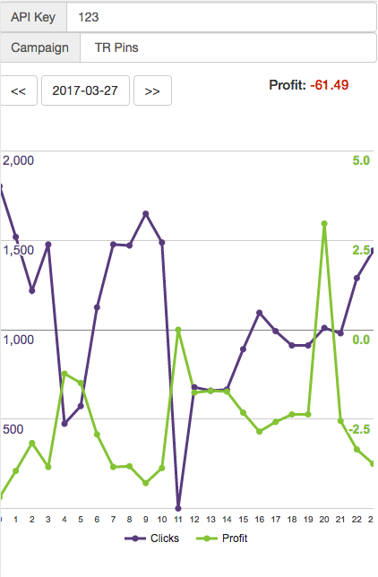

# Binom Pulse: статус трекера у вас на телефоне.

## Инструкция:
- скачать и разархивировать файлик index.html
- положить на свой сервер бинома, в папку `/var/www/binom/graph`
- зайти на свой трекер по адресу: `http://<адрес_трекера.ком>/graph/`
- Страничка попросит API ключ к биному. Введите ключ и нажмите энтер. Страничка немного подумает и выдаст графики Clicks и Profit.
- Дальше ваш ключ сохранится в урле как GET-параметр. Если страницу в таком виде сохранить в избранном, она больше не будет спрашивать ключ.

## О безопасности:
- страничка никуда не лезет, кроме как на апи вашего собственного сервера
- страничка ничего никуда не отправляет (см. код, он прозрачен)

## Поддержка:
- http://defo.cc/showthread.php?t=1538